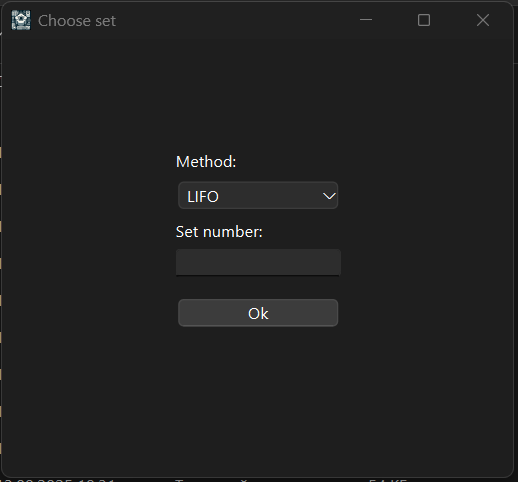

# **Імітаційне середовище розподілу ресурсів на методи/** 

<!-- TOC -->
- [English](#english)
- [Українська](#українська)
<!-- /TOC -->

---

## Українська

**Опис:**
Ця програма була розроблена студентами ХНУРЕ: Василенко Д.О., Бирька Е.М., Лук'янов Я.І., для дослідження методів розподілу (LIFO, FIFO, HPF, SMART й т.д) на ресурси. Ця програма може розширюватись та допомогати з дослідженням нових методів для різних ОС.

---

## **Зміст**

- [Початок роботи](#початок-роботи)
- [Інструкція](#інструкція)
- [Ліцензія](#ліцензія)

---

## **Початок роботи**

1. Клонувати репозиторій:
   ```bash
   git clone https://github.com/WinXpisher/Simulator.git
2. Перейти в каталог(з готовою програмою):
   ```bash
   cd Simulator/App
3. Запустіть готову програму:
   ```bash
   Core.exe

---

## **Інструкція**

1. Після відкриття зустрічає таке вікно:

 

2. Після обирання Generate, ми бачимо таке вікно з вибором методів розподілу та з ручним вводом завдань та ресурсів(зберігаються в папку для наборів):


3. Якщо ви обрали choose, то побачите таке вікно з вибором набору симуляції (зберігаються такі набори в папці App/Simulation data)



4. Незалежно від вибору у вас з'явиться вікно з налаштуваннями набору:


5. Далі з'явиться наступне вікно зі спостереженням щодо виконання задач:


6. У цьому вікні окрім спостереження можна перетягувати рамку Resources, затиснувши ЛКМ на рамці, а також за бажанням вимкнути:


7. Для наступного аналізу, після того як лічильник Clock перестане рахувати, ми можемо вивести гістограму на основі 1 логу або більше:


8. Якщо ви обрали Show graph(для обробки 1 логу), то побачите наступне вікно з вибором бажаного лог файлу:


9. Після обрання та натискання кнопки "Показати", ви попадете в папку з логами відповідного методу, який ви обрали раніше:


10. Після вибору файла, на екрані з'явиться гістограма, де по осі x бачимо "Години", а по осі y "Кількість задач", а також синє - задачі, які виконуються, а оранжеве - в черзі:


11. Якщо ви обрали Show graphs(для обробки декількох логів), то рекомендація створити папку в корені проєкту з назвою multi_logs (App/multi_logs) для зручного додавання, а також щоб набор відповідав нгабору(в папці TestSets буде надано файли та відповідні набори, які використовувались). У вікні можна обрати 3 показника: "Загальний час виконання", "Середній час очікування", "Коефіційєнт простою":


    
12. Після натискання кнопки "Далі", ми можемо обрати декілька логів й воно відобразиться в списку:


13. Після натискання кнопки "Показати", ми побачимо гісограму, де по осі x буде "Номер пулу", а по осі y "Секунди" й різними кольорами відповідні методи, які обрали раніше:


14. Для глибшого вивчення 1 логу, в корневій папці, створиться папка Graphs (App/Graphs), де містяться 2 excel таблиці, в перший показано дані для гістограми (Години, Виконуються, В черзі), а у другій - для детального вивчення методу (Кількість ресурсів, кількість запущених завдань на ресурсі, загальний час використання ресурсу, Відсоток завантаження ресурсу, відсоток простою):


15. Для глибшого вивчення декількох логів, в корневій папці, стовриться папка Multi_graphs (App/Multi_graphs), де буде зберігатись таблиця з назвою методів_та кількістю пулів, а всередині стовбець "Показник", де номера пулу та показники (Tk-час виконання пулу завдань, tav-середній час очікування завдань в черзі, Pd-показник простою обчислювальних ресурсів системи):


---

## **Ліцензія**

Цей проєкт поширюється під ліцензією **GPLv2**.
[Дивитись ліцензію](LICENSE)
---
