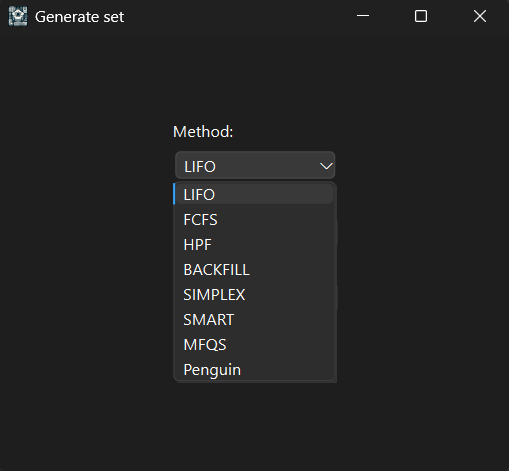

# **Імітаційне середовище розподілу ресурсів на методи/Simulation environment for resource allocation across methods** 

<!-- TOC -->
- [English](#english)
- [Українська](#українська)
<!-- /TOC -->

---

## Українська

**Опис:**
Ця програма була розроблена студентами ХНУРЕ: Василенко Д.О., Бирька Е.М., Лук'янов Я.І., для дослідження методів розподілу (LIFO, FIFO, HPF, SMART й т.д). Ця програма може розширюватись та допомогати з дослідженням нових методів для різних ОС.

---

## **Зміст**

- [Початок роботи](#початок-роботи)
- [Інструкція](#інструкція)
- [Ліцензія](#ліцензія)

---

## **Початок роботи**

1. Клонувати репозиторій:
   ```bash
   git clone https://github.com/WinXpisher/Simulator.git
2. Перейти в каталог(з готовою програмою):
   ```bash
   cd Simulator/App
3. Запустіть готову програму:
   ```bash
   Core.exe

---

## **Інструкція**

1. Після відкриття зустрічає таке вікно:

 

2. Після обирання "Generate", ми бачимо таке вікно з вибором методів розподілу та з ручним вводом завдань та ресурсів(зберігаються в папку для наборів):




3. Якщо ви обрали "Choose", то побачите таке вікно з вибором набору симуляції (зберігаються такі набори в папці App/Simulation data):


4. Незалежно від вибору у вас з'явиться вікно з налаштуваннями набору:


5. Далі з'явиться наступне вікно зі спостереженням щодо виконання задач:


6. У цьому вікні, окрім спостереження, можна перетягувати рамку Resources, затиснувши ЛКМ на рамці, а також за бажанням вимкнути:


7. Для наступного аналізу, після того як лічильник "Clock" перестане рахувати, ми можемо вивести гістограму на основі 1 логу або більше:


8. Якщо ви обрали "Show graph" (для обробки 1 логу), то побачите наступне вікно з вибором бажаного лог файлу:


9. Після обрання та натискання кнопки "Показати", ви попадете в папку з логами відповідного методу, який ви обрали раніше:


10. Після вибору файла, на екрані з'явиться гістограма, де по осі x бачимо "Години", а по осі y "Кількість задач", а також синє - задачі, які виконуються, а оранжеве - в черзі:


11. Якщо ви обрали "Show graphs" (для обробки декількох логів), то рекомендація створити папку в корені проєкту з назвою multi_logs (App/multi_logs) для зручного додавання, а також щоб набор відповідав набору (в папці TestSets буде надано файли та відповідні набори, які використовувались, для прикладу). У вікні можна обрати 3 показника: "Загальний час виконання", "Середній час очікування", "Коефіційєнт простою":


    
12. Після натискання кнопки "Далі", ми можемо обрати декілька логів й воно відобразиться в списку:


13. Після натискання кнопки "Показати", ми побачимо гістограму, де по осі x буде "Номер пулу", а по осі y "Години" й різними кольорами відповідні методи, які обрали раніше:


14. Для глибшого вивчення 1 логу, в корневій папці, створиться папка Graphs (App/Graphs), де містяться 2 excel таблиці, в перший показано дані для гістограми (Години, Виконуються, В черзі), а у другій - для детального вивчення методу (Кількість ресурсів, Кількість запущених завдань на ресурсі, Загальний час використання ресурсу, Відсоток завантаження ресурсу, Відсоток простою):


15. Для глибшого вивчення декількох логів, в корневій папці, створиться папка Multi_graphs (App/Multi_graphs), де буде зберігатись таблиця з назвою методів_та кількістю пулів, а всередині стовбець "Показник", де номера пулу та показники (Tk-час виконання пулу завдань, tav-середній час очікування завдань в черзі, Pd-показник простою обчислювальних ресурсів системи):


---

## **Ліцензія**

Цей проєкт поширюється під ліцензією **GPLv2**.
[Дивитись ліцензію](LICENSE)
---

## English

**Description:**
This program was developed by students of KhNURE: Vasylenko D.O., Birka E.M, Lukianov Y.I., to study distribution methods (LIFO, FIFO, HPF, SMART, etc.). This program can be expanded and help with the study of new methods for different OS.

---

## **Content**

- [Getting started](#getting-started)
- [Instruction](#instruction)
- [License](#license)

---

## **Instruction**

1. After opening, you will see this window:

 

2. After selecting "Generate", we see the following window with a choice of distribution methods and manual entry of tasks and resources (saved in the folder for sets):


3. If you selected "Choose", you will see the following window with a selection of a simulation set (such sets are stored in the App/Simulation data folder):


4. Regardless of your choice, you will see a window with dialling settings:


5. The following window will appear with task performance monitoring:


6. In this window, in addition to observing, you can drag the Resources frame by holding down the LMB on the frame, and also turn it off if desired:


7. For further analysis, after the "Clock" counter stops counting, we can output a histogram based on 1 log or more:


8. If you selected "Show graph" (to process 1 log), you will see the following window with the selection of the desired log file:


9. After selecting and clicking the "Показати"(Show) button, you will be taken to the folder with the logs of the corresponding method you selected earlier:


10. After selecting a file, a histogram will appear on the screen, where on the x-axis we see "Години"(Hours), and on the y-axis "Кількість задач"(Number of tasks), as well as blue - tasks that are being executed, and orange - in the queue:


11. If you selected "Show graphs" (for processing multiple logs), it is recommended to create a folder in the root of the project called multi_logs (App/multi_logs) for easy addition, and also so that the set corresponds to the set (for example, the TestSets folder will provide files and the corresponding sets that were used). In the window you can select 3 indicators: "Загальний час виконання"(Total execution time), "Середній час очікування"(Average waiting time), "Коефіцієнт простою"(Downtime ratio):


    
12. After clicking the "Далі"(Next) button, we can select multiple logs and they will be displayed in the list:


13. After clicking the "Показати"(Show) button, we will see a histogram where the x-axis will be "Номер пулу"(Pool Number), and the y-axis will be "Години"(Hours) and the corresponding methods selected earlier will be shown in different colors:


14. For a deeper study of 1 log, in the root folder, a Graphs folder (App/Graphs) will be created, which contains 2 excel tables, the first shows data for the histogram ("Години"(Hours), "Виконуються"(Running), "В черзі"(Queued)), and the second - for a detailed study of the method ("Кількість ресурсів"(Number of resources), "Кількість запущених завдань на ресурсі"(Number of running tasks on the resource), "Загальний час використання ресурсу"(Total resource usage time), "Відсоток завантаження ресурсу"(Resource load percentage), "Відсоток простою"(Downtime percentage)):


15. For a deeper study of several logs, in the root folder, a Multi_graphs folder (App/Multi_graphs) is created, where a table with the name of the methods and the number of pools will be stored, and inside the tables a column "Показник"(Indicator) with pool numbers and indicators (Tk-task pool execution time, tav-average waiting time for tasks in the queue, Pd-indicator of system computing resources downtime):


---

## **License**

This project is distributed under the license **GPLv2**.
[View license](LICENSE)

---
